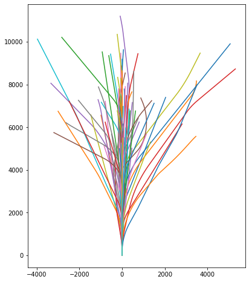

# Location prediction using density estimation

This is a small toy project to predict the paths of moving objects, e.g. marine vessels. Its main purpose is as a CV-padder, so it is relatively simple, but if it contains any code which you find useful, feel free to use it with reference. This section of the README acts as a write-up and rationale. The [Package Structure](./README.md#Package-Structure) section outlines the package structure and use. If you're busy and would rather just dive in with an example, check out the [Track and Visualise Notebook](./TrackAndVisualise.ipynb).

## Theoretical considerations
### Trajectories or not

Strictly speaking, this project does not predict trajectories, but it predicts future locations at a set time, i.e. the end-point of the trajectory up to that moment. It could be altered to predict trajectories by outputting a vector of locations, or it could be altered to be conditional on time, so that it can make predictions of the end-point at any time step (hence the trajectory). However, for many purposes this implementation is sufficient; if we are tracking an object using observations at fixed time intervals then information of what is happening *between* those intervals is extraneous.

### Isn't this just object tracking?

No. Object tracking is about consistent identification of an object and its location over a set of frames.

Here I assume that a method for object-identification already exits, but that the object is rarely observed, which is not the same as in object tracking.

### Does this relate to Kalman filtering?
Kalman filtering is used in similar situations and may have some use for a real-world extension of this sort of model, although I haven't thought about it deeply. Given a model, Kalman filtering reconciles the stochastic dynamics of the model with the noisy real-world observations of its outcomes. Here I'm assuming noiseless observations and, in its present state, I haven't implemented multi-step tracking, although it is not a big extension of the current code to do so. In short, Kalman filtering is not relevant to this example, but might have application to a more sophisticated one.

### Stochastic processes need stochastic predictions
For a stochastic process, even given the exact same input conditions, the outcome is not guaranteed. This is sometimes considered to be because of latent unobserved variables, but if you ask a quantum physicist, it is a fundamental property of performing observations.

In cases where certainty is important, we should model the uncertainties which are present. Producing a single estimate for the state of a system - even if it is the best one - throws away a lot of information. This is why stochastic [density estimators](./README.md#Density-estimators), which produce stochastic predictions work well for this project.

## The simulator
We need a simulator to generate fake data. The simulator is not a critical part of the application - we just need some data from somewhere. I've written a simulator with a toy model of a moving sea vessel. See the below image for 100 simulated trajectories from this simulator with the default settings (axes can be presumed to be in metres, but it doesn't really matter.)



## Density estimators
Given a set of observations are drawn from some underlying probability distribution a density estimator attempts to learn the distribution that these observations came from. There are two main modes for density estimators

1. sampling
2. likelihood evaluation

Generative AI, such as GANs do 1. and Bayesian methods such as variational inference, are helpful for point 2. Normalising flows, which I use in this project, can do both. The reason why both procedures are valuable is demonstrated in the extended example of the [Track and Visualise Notebook](./TrackAndVisualise.ipynb)

### Conditioning
It is not difficult to extend the model to condition upon informative data such as the ship bearing or velocity. However, given that I initialise all ships under the same conditions in the simulator I've written, this is not productive for this project in its current state. Some examples of interesting real-world conditioners:

1. GPS location
2. Depth-gradient
3. Bearing of nearest port
4. Vessel id
5. Weather
6. Currents


# Package Structure
There are four main files

## simulator.py
This includes a simulator for mock trajectories of, say, a marine vessel. The trajectories are modelled as concatenated arc segments, where the angle of the arc-segment and the speed along which an object traverses it are stochastic. It containers the Simulator class.

### usage example
```python
from simulator import Simulator
import torch
sim = Simulator(
                 time_per_action = 10, 
                 total_time = 1000,
                 wobbliness = torch.tensor(0.1),
                 jerkiness = torch.tensor(0.1),
                 )

inputs = {'position': torch.tensor([0.,0.]), 'speed':torch.tensor(7.), 
          'orientation': torch.tensor(0.), 'rudder_angle': torch.tensor(0.)}

final_position, final_orientation, trajectory = sim(**inputs)
```

## training.py
This includes the main training code, as well as a datloader utility function. It relies on flow.py, in which I have simply imported an existing architecture for normalising flows from the sbi package, with some very minor adaptation. The main class is the Trainer class.

### usage example
```python
from flow import UnconditionalFlow
from training import get_dataloaders, get_default_flow, Trainer

train_loader, val_loader = get_dataloaders()
flow = get_default_flow(train_loader)


trainer = Trainer(train_loader, val_loader, flow)
trainer.train(epochs=100)
```

## tracking.py
This file contains the code for using a density estimator to perform tracking. It contains three classes: Tracker2D, SamplingTracker2D and GridTracker2D. Given a set of points, the base tracker class will scan around these points for the search object. The sampling tracker and grid tracker only differ in that they produce points in a particular way, and these can be then be fed back to the base class.

1. The sampling tracker samples points randomly from the density estimator - it is fast, but fails on rare events.
2. The grid tracker spans the space with a grid of points - it slow, but is unlikely to fail even on rare events.

All trackers rank the points by according to their probability under the density estimator, and search through them in order.

### usage example
```python
from tracking import SamplingTracker2D

samplingtracker = SamplingTracker2D(flow, 10) # Initialise with scan radius of 10
true_position = torch.tensor([0, 6000]) # In the real world, this obviously wouldn't be provided.
checked, found = samplingtracker.simulate_tracking(true_position) 
```

## visualisation.py
This is currently a bit more *under construction*, but contains some useful visualisation utility functions. 
